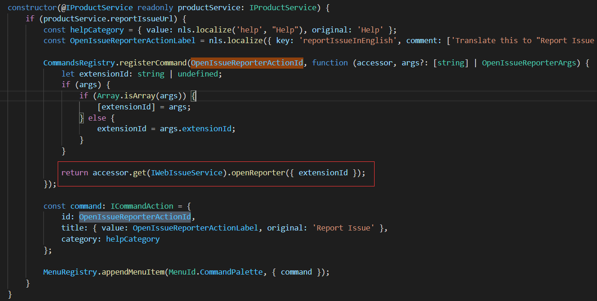
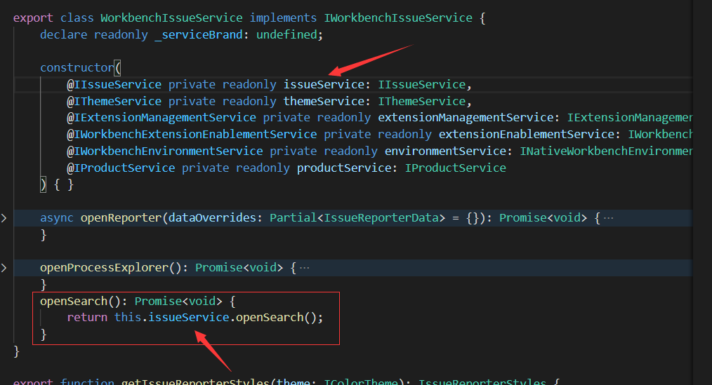
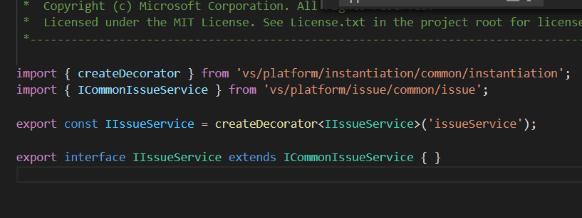
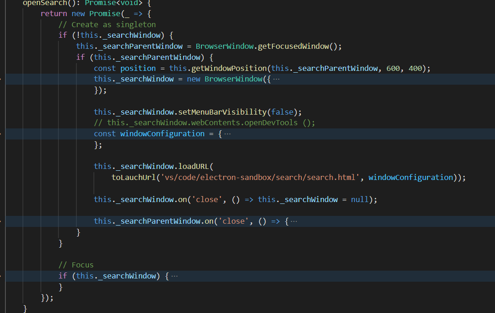

> 仿照eclipse全局搜索UI 仿照Help->Report Issue弹出新窗口

## 步骤

*   创建顶部搜索菜单以及搜索子菜单
*   search选项添加注册事件并触发search弹窗
*   创建search弹窗页面

## 实现

### 创建顶部菜单选项

根据vscode源码结构分析，找到`src\vs\workbench\browser\parts\titlebar\menubarControl.ts`文件，新增Search一级菜单选项。  因为模仿`Report Issue`菜单选项操作，全局搜索到`Report &&Issue`字符，`&&`为助记符，通过观察源码猜测跟国际化，正则匹配有关。结合源码结构分析，定位到`src\vs\workbench\electron-sandbox\desktop.contribution.ts`，该文件内容符合既需要操作DOM又需要使用electron主进程API的特点。在此文件下添加注册二次菜单源码如下： 

### search选项添加注册事件

为了借鉴reportIssue菜单的事件方法，全局搜索reportIssue菜单绑定的’workbench.action.openIssueReporter‘ 相关命令。 最终确定内容文件为`src\vs\workbench\contrib\issue\electron-browser\issue.contribution.ts` 同文件夹下还有`src\vs\workbench\contrib\issue\browser\issue.web.contribution.ts`文件用于在浏览器端执行。 具体代码如下：  在该文件下添加search命令如下：  补充新增命令所需的同级search变量和方法，定位 accessor.get(IWorkbenchIssueService).openReporter(data);中openReporter方法定义，进入`'vs/workbench/contrib/issue/electron-browser/issue`文件，接口声明如下：  转入接口实现文件`src\vs\workbench\contrib\issue\electron-browser\issueService.ts`,并添加`openSearch`方法。  注意issueService变量通过@IIssueService进行构造参数注入，转到注入的函数文件为`vs/platform/issue/electron-sandbox/issue`,实现如下：  可知该接口继承`ICommonIssueService`,进入`ICommonIssueService`函数文件`vs/platform/issue/common/issue`找到相关open方法如下：  添加openSearch方法参数，进入该接口实现文件`src\vs\platform\issue\electron-main\issueMainService.ts` 添加openSearch方法实现，如下：

### 创建search弹窗页面

此时已经通过注入依赖完成了渲染页面的生成，参考reportIssue页面加载路径，我们把search弹窗页面添加在`vs/code/electron-sandbox/search/search.html`目录下。  引入自定义js文件，在js文件中，使用bootstrop-window.js文件下定义的MonacoBootstrapWindow方法，能够加载引入的ts文件，具体如下：  自定义一个ts文件，可在里面编写交互逻辑。