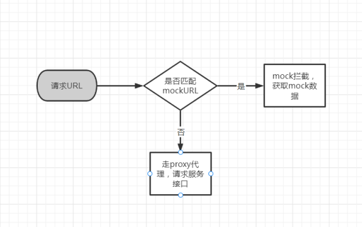

---
title: mockjs在前端项目中的应用
tags: []
categories: 
    - - 工作日志
date: 2023-04-14 10:38：00
---
### 使用mockjs模拟请求数据
> Mock.js 是一个前端数据模拟库，它可以拦截前端代码中的 XMLHttpRequest 请求，并返回模拟的数据；在前端开发中，使用 Mock 数据可以帮助我们模拟后端接口数据，提高开发效率，同时也可以减少对后端接口的依赖。

示例：
```javascript
  // 引入 Mock.js
  import Mock from 'mockjs'

  // 使用 Mock.js 模拟数据
  Mock.mock('/api/users', 'get', {
    code: 200,
    message: '请求成功',
    'data|10-20': [{
      'id|+1': 1,
      name: '@cname',
      age: '@integer(20, 50)',
      'gender|1': ['男', '女'],
      address: '@county(true)',
      avatar: '@image("100x100")'
    }]
  })
```
#### 使用 webpack-dev-server 的 proxy 功能将ajax请求转发到后端服务中
> Mock.js 和 devServer 代理的作用方式不同，所以它们的拦截顺序也不同。在默认情况下，Mock.js 会比 devServer 代理先执行，即 Mock.js 可以拦截前端请求并返回模拟数据，而不会将请求转发到后端服务器。如果想让 devServer 代理先执行，可以通过配置 before 选项将其放到 Mock.js 之前执行。
- 流程图

- 实现
  ```javascript
  // main.js
  process.env.VUE_APP_MOCK === 'true' && require('@/mock/index')

  // .env.mock
  # just a flag
  ENV = 'mock'

  # base api
  VUE_APP_MOCK = true
  VUE_APP_BASE_API = '/api'
  VUE_APP_PROXY_API='http://your.service.com'


  // vue.config.js
  devServer: {
    proxy: {
      '/api': {
        target: process.env.VUE_APP_PROXY_API,
        pathRewrite: {
          '^/api': ''
        }
      }
    }
  }

  ```